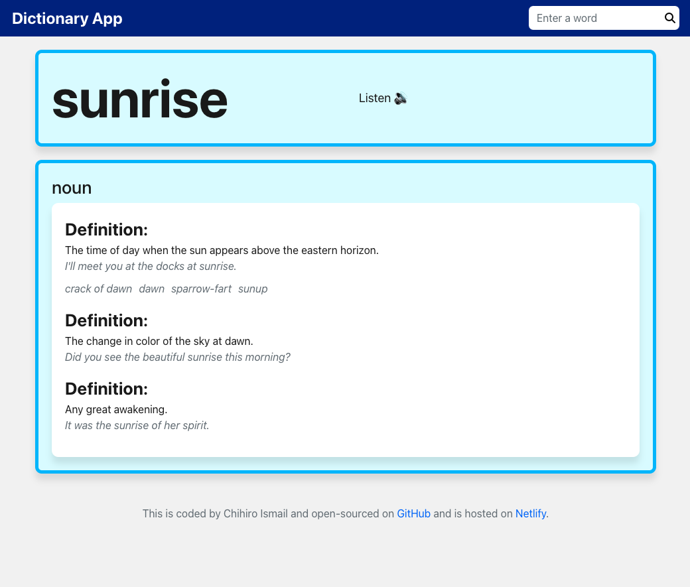
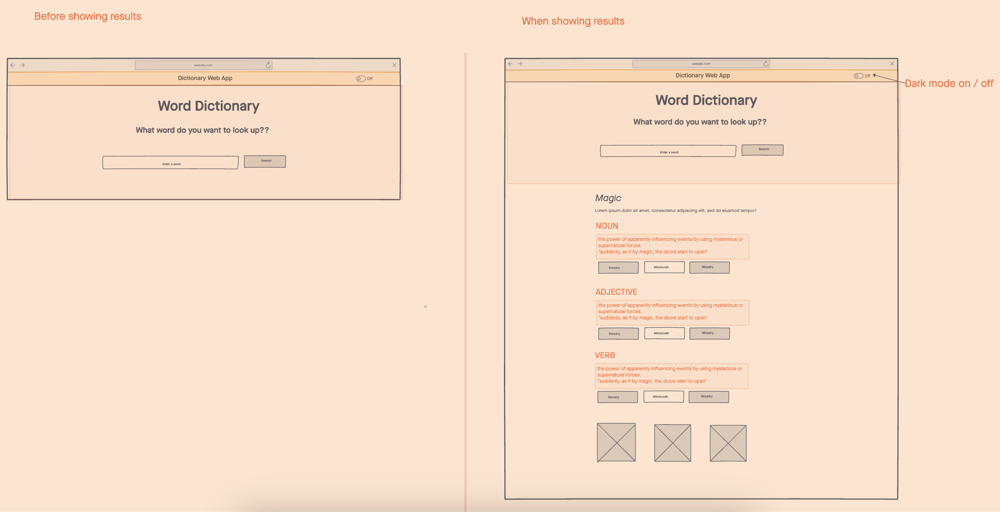

# Dictionary App on ReactJS

## About

This is a dictionary web app, where you can search words to look for definitions and phonetics. 
You can see my app [here](https://incomparable-quokka-38a228.netlify.app/) (Hosted on Netlify) .

### Features

- word searching
- phonetics playback
- synonymous 
- example sentences
- responsive
(This app is uding two different APIs; one for definition and the other for phonetics)

## Purpose

This was a part of my learning path to Front-End development, especially ReactJS. I chose to do this project for the following reasons;

- to learn the state management: A dictionary needs to fetch definitions from an API, display them dynamically, and play pronounciation playback. 
- to learn API integration: the app fundamentally relies on consuming external API to retrieve definitions and phonetics. 

### Skills

- ReactJS
- APIs
- Bootstrap
- Git and GitHub
- JavaScript
- CSS
- Hosting 

### Wireframe
The below is a wireframe I made before creating the app;

or visit my invision page on [here](https://projects.invisionapp.com/freehand/document/H5zU78iQi?)

## Scalability
If I decide to enhance my didctionary app in the future, ReactJS's scsalability is a major asset. I'd like to add the features below;

- antonymous
- user saved word lists
- word-related pictures
